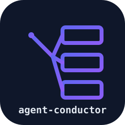

<div align="center">
  

  # agent-conductor

  **Pilot N concurrent AI coding agent CLI sessions from one place.**

  <p>
    <a href="https://github.com/zorahrel/agent-conductor/releases"></a>
    <a href="./LICENSE"></a>
    <a href="https://github.com/zorahrel/agent-conductor/actions/workflows/ci.yml"></a>
    
    
    
    
    
    
  </p>
</div>

---

## What it does

When you're running 3+ Claude Code (or other AI coding agent) CLI sessions in parallel — across tmux panes, separate terminals, or both — keeping track of which one needs your attention is a context-switching nightmare.

`agent-conductor` is the toolkit that turns N scattered sessions into one observable, controllable, auditable surface.

- **Read-only observatory** — parses each session's JSONL transcript without re-reading the full file (tails the last N bytes) and derives a refined 5-state status: `awaiting_user_input` / `tool_pending` / `crashed` / `working` / `idle`
- **Deterministic suggestion engine** — produces a next-step recommendation per session via a lookup table (no LLM calls, no token cost, no flakiness)
- **Cwd-collision lock** — detects when two sessions are working on the same path. Worktree-aware: walks `.git` roots so sibling worktrees don't false-positive
- **tmux inject control** — maps `pid → pane` via parent-walk, sends keystrokes via `tmux send-keys`, and writes an append-only audit log (JSONL with 10 MB rotation)
- **macOS Reminders bridge** — treats Apple Reminders as the intent layer. New todos sync to iPhone / Watch / Siri; check them off anywhere, the polling diff loop emits `todo:added` / `todo:completed` / `todo:updated`

## Side-car, not host — when NOT to use this

There are two ways to "manage many AI coding sessions" and they look the same from outside but are architecturally opposite:

| | **Side-car / observer** (this library) | **Host / controller** |
|---|---|---|
| Process ownership | None. Finds existing sessions via `ps`. | Spawns the CLI as a `ChildProcess` and owns its stdin/stdout. |
| Data source | Tails the JSONL transcript on disk. | Live protocol stream (stream-json, JSON-RPC). |
| Inject | `tmux send-keys` into your existing pane. | `process.stdin.write` at the protocol level. |
| Status latency | File mtime + 2 s cache. | Live, from owned process events. |
| Permission prompts / `AskUserQuestion` | Not visible — the CLI is talking to the human's terminal. | Intercepted from `control_request` events. |
| Runtime model / reasoning / service tier swap | Not possible — the CLI is already running. | Set on the owned process. |
| Crash detection | Heuristic (`pidAlive===false AND no stop_reason`). | Deterministic (`child.on('exit')`). |
| Works on a Claude Code session the human launched 3 hours ago in tmux | ✅ that's the whole point | ❌ has to be the one to start it |

If you want a turnkey Electron workspace with Kanban, drag-drop panes, PR integration, signed installers, and an opinionated UI that owns every agent it talks to, use **[Tessera](https://github.com/horang-labs/tessera)**. It is excellent at being that thing.

`agent-conductor` is the toolkit you reach for when:

- You want to observe and pilot sessions **a human (or another tool) already started** in their own tmux/terminal — without ripping them out of their workflow.
- You want **primitives** (`buildSnapshot()`, `sendKeys()`, `listTodos()`) to compose into your own dashboard, menu-bar app, notch UI, Discord bot, or router — not a finished IDE.
- You want an **append-only JSONL audit log** for every inject (forensic-grade, `jq`-friendly, 10 MB rotation) — not a SQLite-only history.
- You want **zero runtime deps** and a `bin` you can drop into CI / cron / scripts.
- You want **macOS Reminders as the intent layer** — todos that flow from Siri / Watch / iPhone into your agents, not a workspace UI that owns the todos.
- You want a **deterministic suggestion engine** (pure lookup table, no LLM, no token cost) that you can gate auto-pilot on with `confidence === "high"`.

The two approaches compose well: `agent-conductor` can sit alongside a host-mode workspace and observe sessions the workspace doesn't own. An MCP server surface that makes this composition first-class is on the v0.5 roadmap (see below).

## Multi-provider by default

Every agent CLI stores its sessions differently — Claude Code uses JSONL under `~/.claude/projects/`, Aider writes markdown, Cursor's CLI has its own format. Rather than hardcode "this is for Claude Code", `agent-conductor` ships with an `AgentProvider` interface and a registry of providers. Claude Code is the default; switching provider is one flag away.

```bash
agent-conductor providers list
# NAME        │ DISPLAY     │ DEFAULT │ DESCRIPTION
# ────────────┼─────────────┼─────────┼─────────────────────────────────────────
# claude-code │ Claude Code │ ★       │ Anthropic's Claude Code CLI…
# aider       │ Aider       │         │ AI pair-programming CLI…
# cursor-cli  │ Cursor CLI  │         │ Anysphere's Cursor CLI…
```

Current support matrix (v0.4):

| Provider | Discovery | Transcript | Status | Suggest | Inject |
|---|---|---|---|---|---|
| `claude-code` ★ | ✅ | ✅ | ✅ | ✅ | ✅ (tmux) |
| `aider` | ✅ | ⏳ v0.5 | ⏳ v0.5 | stub | ✅ (tmux) |
| `cursor-cli` | ✅ | ⏳ v0.5 | ⏳ v0.5 | stub | ✅ (tmux) |

Implement your own:

```typescript
import { registerProvider, type AgentProvider } from "agent-conductor";

const myProvider: AgentProvider = {
  name: "my-coding-agent",
  displayName: "MyAgent",
  description: "…",
  async discover() { /* find live sessions */ },
  async readTranscript(session, limit) { /* parse your transcript format */ },
  async deriveStatus(session) { /* awaiting_user_input / tool_pending / … */ },
  suggestNext(session, lastSummary, status) { /* deterministic next-step */ },
  async inject(session, text) { /* tmux send-keys, HTTP POST, …  */ },
};

registerProvider(myProvider);
// Now usable: agent-conductor snapshot --provider my-coding-agent
```

The data flow is universal: any consumer that wants to monitor and pilot multiple agent CLI processes on the same machine benefits from these primitives. Extracting them as a library means:

- Single source of truth — fix a bug once, benefit everywhere
- Data-source agnostic — `buildSnapshot(sessions)` accepts sessions; the provider supplies them
- Pluggable — v0.4 ships 3 providers; v0.5 plans full Aider + Cursor + ChatGPT CLI

## Install

```bash
npm install github:zorahrel/agent-conductor#v0.3.0
# or pin to a specific commit
npm install github:zorahrel/agent-conductor#<sha>
```

> Distributed via git URL. The `dist/` directory is committed so consumers don't need to build the package. NPM-registry publish is on the v0.4 roadmap.

## CLI

After installation, the `agent-conductor` command is available globally (when installed with `-g`) or via `npx agent-conductor` / `./node_modules/.bin/agent-conductor`:

```bash
agent-conductor --help                         # show all subcommands
agent-conductor providers list                 # see registered providers
agent-conductor providers info aider           # details + capabilities

agent-conductor snapshot                       # default: Claude Code
agent-conductor snapshot --provider aider      # switch provider
agent-conductor snapshot --all-providers       # merge sessions across all
agent-conductor snapshot --json                # raw OrchestratorSnapshot JSON

agent-conductor sessions                       # discovery-only (cheaper than snapshot)
agent-conductor sessions --provider cursor-cli # Cursor CLI sessions only
agent-conductor sessions --all-providers       # all running AI agents

agent-conductor transcript path/to/file.jsonl --limit 5
agent-conductor todos list --list AgentTasks
agent-conductor todos add "Refactor auth" --pid 1234 --repo demo-app --phase plan
agent-conductor todos complete REM-001
agent-conductor tmux panes                     # all tmux panes (pid → session+pane)
agent-conductor tmux find 12345                # which pane owns this pid?
agent-conductor inject --pid 12345 --text y    # send "y\n" to the pane (with audit)
agent-conductor inject --pid 12345 --text y --force   # bypass cwd-collision check
agent-conductor inject --pid 12345 --text y --dry-run # log only, no send
agent-conductor audit --tail 20                # recent audit log entries
```

Exit codes: `0` success, `1` generic error, `2` usage error, `3` precondition failure (no tmux, list missing, etc.). Stable contract for scripts.

## Quick start

```typescript
import {
  buildSnapshot,
  listTodos,
  addTodo,
  sendKeys,
  appendAudit,
} from "agent-conductor";

// 1. Snapshot every live AI coding session on this machine
const sessions = await myDiscoveryFunction();   // your registry / ps+lsof
const snap = await buildSnapshot(sessions);
console.log(snap.sessions);
// → [{ pid, repo, branch, status, last_assistant_summary, suggestion, action, todo_link, tmux, conflict }]

// 2. Read intent from Apple Reminders (macOS only)
const todos = await listTodos({ list: "AgentTasks" });
const newTodo = await addTodo({
  title: "Refactor auth module",
  body: "pid:1234 repo:demo-app phase:plan",
  list: "AgentTasks",
});

// 3. Pilot a session: send Enter to approve a plan in tmux pane %17
await sendKeys({ paneId: "%17", text: "y", enter: true });
await appendAudit({
  pid: 1234,
  repo: "demo-app",
  action: "inject",
  text: "y",
  source: "user-approved",
  ts: Date.now(),
});
```

## API surface

| Import | Exposes |
|--------|---------|
| `agent-conductor` | Full barrel (most common) |
| `agent-conductor/jsonl` | Transcript parser — `readJsonlTailLines`, `extractLastAssistantTurn`, `extractPendingToolUses`, `getStopReason`, `extractToolUseEvents`, `sumTokens`, `countTurns` |
| `agent-conductor/sessions` | Observer + composer — `refinedStatusFor`, `findGitRoot`, `detectConflict`, `suggestNext`, `composeSnapshot`, `buildSnapshot`, `buildTranscript` |
| `agent-conductor/tmux` | Write controls — `listAllPanes`, `findPaneForPid`, `sendKeys`, `capturePane`, `appendAudit` |
| `agent-conductor/reminders` | Intent layer — `getActiveCli`, `probeAuth`, `listTodos`, `addTodo`, `completeTodo`, `parseTodoMetadata`, `formatTodoMetadata`, `diffTodos`, `startReminderPolling`, `stopReminderPolling` |

Full types are exported via the barrel: `RefinedStatus`, `Confidence`, `Suggestion`, `AuditEntry`, `SnapshotEntry`, `OrchestratorSnapshot`, `ReminderTodo`, `TodoMetadata`, `TodoPhase`, `TodoEvent`, `LocalSession`, `LocalSessionStatus`.

## Design principles

1. **Library doesn't own its data source.** `buildSnapshot(sessions)` accepts sessions; you bring discovery
2. **No LLM calls in the suggestion engine.** Pure lookup table. Predictable, free, idempotent
3. **Pure functions where possible.** `composeSnapshot()` is sync + pure — trivially unit-testable without tmpdirs or env mocks
4. **Graceful degradation.** `remindctl` missing or unauthorized → API returns `{authorized: false, banner: "…"}`. Never throws. Local `~/.config/agent-conductor/todos.json` fallback planned for v0.2
5. **`execFile` arg-array everywhere.** No shell strings for tmux/CLI invocations (security + cross-platform sanity)
6. **Worktree-aware.** `lock.ts` walks `.git` roots before comparing paths, so sibling worktrees of the same repo don't false-positive as a conflict

## Roadmap

### v0.2 — Public release ✅

- [x] MIT license, public repo
- [x] English docs + logo
- [x] Sanitized fixtures (no PII)

### v0.3 — CLI binary + community docs ✅

- [x] `agent-conductor` CLI with `snapshot` / `sessions` / `transcript` / `todos` / `tmux` / `inject` / `audit`
- [x] CI matrix (Node 20 + 22), bash CLI integration tests
- [x] `CONTRIBUTING.md`, `CODE_OF_CONDUCT.md`, `SECURITY.md`, examples

### v0.4 — Multi-provider architecture ✅ (current)

- [x] `AgentProvider` interface + registry
- [x] `claude-code` provider — full impl
- [x] `aider` + `cursor-cli` providers — discovery + tmux inject (transcript parsers ⏳ v0.5)
- [x] `--provider` and `--all-providers` flags on all read commands

### v0.5 — Headless daemon + MCP surface (next)

Doubling down on the side-car positioning: instead of competing on UI, become the **observability back-end** that other workspaces (Tessera, custom dashboards, the user's own notch / tray / router) consume via standard protocols.

- [ ] **MCP server** — expose `snapshot`, `inject`, `audit`, `todos`, `transcript` as MCP tools. Host-mode workspaces can read live state of sessions they don't own. Spec: [`docs/v0.5-spec.md`](./docs/v0.5-spec.md).
- [ ] **Headless daemon** — long-running process with HTTP + WebSocket transport. Stable contract for non-Node consumers (Swift menu-bar, Rust TUI, Python script).
- [ ] **Time-series metrics** — local SQLite of `(ts, pid, refinedStatus, turn_count, tool_count)` so dashboards can graph activity without re-parsing JSONL. Prometheus-format exporter optional.
- [ ] **Aider transcript parser** — `.aider.chat.history.md` to `TranscriptTurnShape`.
- [ ] **Cursor CLI transcript parser** — whatever format it stabilises on.

### v0.6 — Cross-platform intent layer

- [ ] Local-file fallback (`~/.config/agent-conductor/todos.json`) with watch-mode
- [ ] Linux intent backends (`task` / `todo.txt` / `gnome-todo`)
- [ ] Windows: Microsoft To Do via Graph API (optional)
- [ ] ChatGPT CLI adapter (`shell-gpt`, `chatblade`)

### Maybe-someday

- [ ] Multi-machine snapshot federation (SSH + local cache)
- [ ] Slack / Discord push when a session enters `awaiting_user_input`
- [ ] Things 3 / Todoist / Notion adapters (Reminders alternatives)
- [ ] Auto-pilot mode behind a budget cap (`confidence: high` only)

Contributions or proposals on any of the above are welcome via issues or PRs.

## Requirements

- Node.js ≥ 20
- macOS (for tmux + Apple Reminders integration). The JSONL parser, suggestion engine, and lock detector work on any platform; tmux/Reminders are macOS-specific for v0.2
- `tmux` ≥ 3.0 (for write-side controls)
- `remindctl` ≥ 0.1 from `steipete/tap` (or `apple-reminders-cli` / `ekctl` as fallback with reduced features)

```bash
brew install tmux
brew install steipete/tap/remindctl
```

## Development

```bash
npm install
npm test           # node:test, 68 specs
npm run typecheck
npm run build      # tsup ESM+CJS dual + .d.ts
```

Test framework: `node:test` + `node:assert/strict` (zero test dependencies).
Build: `tsup` (ESM + CJS + `.d.ts` per subpath).
TypeScript: 5.7 strict mode.

## Privacy & data

- All fixtures in this repo are synthetic. The Reminders sample data uses dummy UUIDs and the generic list name `AgentTasks`
- The `audit.jsonl` log writes to `~/.claude/jarvis/orchestrator/audit.jsonl` by default. Override via the `AGENT_CONDUCTOR_AUDIT_DIR` environment variable
- No telemetry. No network calls (other than your own consumer code)

## Contributing

Bug reports, feature requests, and pull requests are welcome at [github.com/zorahrel/agent-conductor/issues](https://github.com/zorahrel/agent-conductor/issues).

## License

[MIT](./LICENSE)
